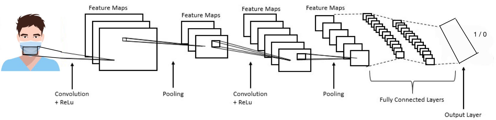

# Face-Mask-Detection-Deep-Neural-Network-Triple-Solution
Three types of solutions to the Mask-Detection problem where the first is presented in the form of a convolution network, the second in a network that is fully connected and the third is based on a transfer network. All of them are based Tensorflow keras.
<ul>
  <li>
    <h2>Background</h2>
    This report describes the mask detection problem and its solution. It contains three configurations that describe three different neural networks: the first, a Fully Connected Network. The second, transfer-learning based network and the third, a Convolutional neural network. 
In this report you will find the complete process of solving this problem using the models described above and additional information such as graphs, code lines screenshots, Loss vs Validation, and other ML concepts that will contribute to the understanding of our project.

  </li>
  
  <li>
    <h2>Data Description</h2>
    The data used for training the model contains 10,000 images which half of them shows a person with a face-mask and the other half non-masked faces.The data we are using contains a validation set, with 1000 pictures, 500 masked-faces and 500 non-masked faces.
The third set, used for testing the model, contains 1000 pictures, 500 masked-faces and 500 non-masked faces.
The data you can get for free from www.kaggle.com from the link <a href="https://www.kaggle.com/ashishjangra27/face-mask-12k-images-dataset
">Here</a>
  </li>
  
   <li>
    <h2>Networks and Architecture</h2>
    <b>The first configuration</b> was built by us from end to end, the architecture used in this configuration is <li>
      CNN- Convolutional Neural Network which consists of several layers that implement feature extraction, and then classification.
The CNN layers:
Conv2D Layer - The filter parameter means the number of this layer's output filters
The kernal_size parameter is commonly used 3*3.
The activation parameter refers to the type of activation function.
The padding parameter is enabled to zero-padding.
The input_shape parameter has pixel high and pixel wide and have the 3 color channels: RGB
</li>
<li>
MaxPool2D Layer - to pool and reduce the dimensionality of the data.
 </li>
 <li>
Flatten Layer -  flatten is used to flatten the input to a 1D vector then passed to dense.
  </li>
  <li>
Dense Layer (The output layer) - the units parameter means that it has 2 nodes one for with and one for without because we want a binary output.
The activation parameter - we use the RELU and SIGMOID activation functions on our output so that the output for each sample is a probability distribution over the outputs of with and without mask.
  </li>
    
  </li>
  
   <li>
    <h2>Training Process</h2>
    example example example
  </li>
  
   <li>
    <h2>Conclusion</h2>
    example example example
  </li>
</ul>
