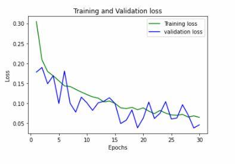
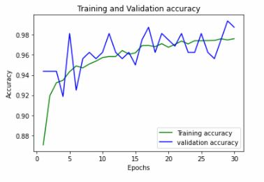
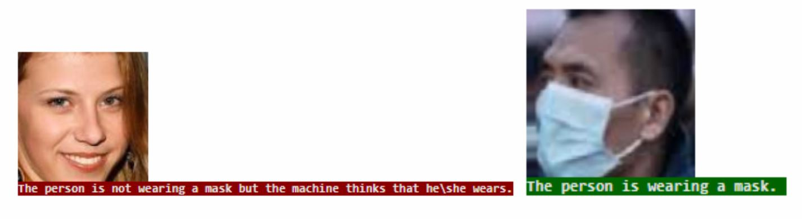

# Face-Mask-Detection-Deep-Neural-Network-Triple-Solution
Three types of solutions to the Mask-Detection problem where the first is presented in the form of a convolution network, the second in a network that is fully connected and the third is based on a transfer network. All of them are based Tensorflow keras.
<ul>
  <li>
    <h2>Background</h2>
    This report describes the mask detection problem and its solution. It contains three configurations that describe three different neural networks: the first, a Fully Connected Network. The second, transfer-learning based network and the third, a Convolutional neural network. 
In this report you will find the complete process of solving this problem using the models described above and additional information such as graphs, code lines screenshots, Loss vs Validation, and other ML concepts that will contribute to the understanding of our project.

  </li>
  
  <li>
    <h2>Data Description</h2>
    The data used for training the model contains 10,000 images which half of them shows a person with a face-mask and the other half non-masked faces.The data we are using contains a validation set, with 1000 pictures, 500 masked-faces and 500 non-masked faces.
The third set, used for testing the model, contains 1000 pictures, 500 masked-faces and 500 non-masked faces.
The data you can get for free from www.kaggle.com from the link <a href="https://www.kaggle.com/ashishjangra27/face-mask-12k-images-dataset
">Here</a>
  </li>
  
   <li>
    <h2>Networks and Architecture</h2>
    <b>The first configuration</b> was built by us from end to end, the architecture used in this configuration is <li>
      CNN- Convolutional Neural Network which consists of several layers that implement feature extraction, and then classification.
The CNN layers:
Conv2D Layer - The filter parameter means the number of this layer's output filters
The kernal_size parameter is commonly used 3*3.
The activation parameter refers to the type of activation function.
The padding parameter is enabled to zero-padding.
The input_shape parameter has pixel high and pixel wide and have the 3 color channels: RGB
</li>
<li>
MaxPool2D Layer - to pool and reduce the dimensionality of the data.
 </li>
 <li>
Flatten Layer -  flatten is used to flatten the input to a 1D vector then passed to dense.
  </li>
  <li>
Dense Layer (The output layer) - the units parameter means that it has 2 nodes one for with and one for without because we want a binary output.
The activation parameter - we use the RELU and SIGMOID activation functions on our output so that the output for each sample is a probability distribution over the outputs of with and without mask.
  </li> 
      
   <b>The second configuration</b> is a transfer-learning configuration, in that case we used the MobileNet V2 architecture. 
MobileNetV2 is a convolutional neural network architecture that seeks to perform well on mobile devices. 
It is based on an inverted residual structure where the residual connections are between the bottleneck layers.
We fine-tuned MobileNetV2 on our mask/no mask dataset and obtained a classifier.
In MobileNetV2, there are two types of blocks:
One is a residual block with stride of 1. Another one is a block with stride of 2 for downsizing.
There are 3 layers for both types of blocks.This time, the first layer is 1×1 convolution with ReLU6.	The second layer is the depthwise convolution.
The third layer is another 1×1 convolution but without any non-linearity. It is claimed that if RELU is used again, the deep networks only have the power of a linear classifier on the non-zero volume part of the output domain.to the network we imported we added a few fully connected layers of our own.
      
  <b>The third configuration</b> we used is Fully Connected Network which consists of several fully connected hidden layers. 
fully connected layer is a function from ℝ m to ℝ n. Each output dimension depends on each input dimension. 
The Fully Connected Neural Network layers:
<li>
Flatten Layer -  flatten is used to flatten the input to a 1D vector then passed to dense.
 </li>
 <li>
Dense Layer - we have two dense layers, in the first we used the RELU activation function and in the second Dense layer (the output layer)  we used the  Sigmoid activation function.
  </li>
      

   
  </li>
  
   <li>
    <h2>Training Process</h2>
  <h4>CNN</h4>
  In order to train our model, first we divided the data with augmentation in a way which assigned the Validation a minor part of the entire data - only 0.05, and the rest of the data served as the major training set- 0.95.
In addition, we defined the value of our batch size and the epochs to be 8 and 15 respectively. We resize the input image into 70 x 70.
  We used Adam optimizer, a stochastic gradient descent method  that updates the weights of the network after every single example. The amount that the weights are updated during training is referred to as the step size or the “Learning Rate”.
The learning rate controls how quickly the model is adapted to the problem. 
smaller learning rates require more training epochs given the smaller changes made to the weights each update, whereas larger learning rates result in rapid changes and require fewer training epochs.
In the first try we selected a rather high learning rate. 
  We used the Binary Cross-Entropy Loss also called Sigmoid Cross-Entropy loss. 
It is a Sigmoid activation plus a Cross-Entropy loss which evaluates how good or bad the predicted probabilities are. If we fit a model to perform this classification, it will predict a probability of being faces with mask to each one of our images. 
It should return high values for bad predictions and low values for good predictions.

This caused our model to reach an unsatisfying solution.

We calculated the success rate by using a counter and divided the number of successful identification by the total number of pictures in the test dataset.
In this attempt we achieved a disappointing success rate of 48 percent.

As a result, we concluded that we must decrease our hyperparameter - learning rate, and simultaneously raise the number of epochs, and so we increased the number of epochs from 15 to 30, which means we doubled the number of epochs which will allow our model a better learning process on the same data set.

Due to the fact that we raised the number of epochs to 30 and decreased the learning rate to 0.0001 our model took two hours to process the data-set. while when the number of epochs was 15 and the learning rate was 0.5 it took the model 20 minutes to process the data.

The change of the parameters led to improvement in the received outcomes when comparing the result shown below and above.
       
As depicted in the graphs above, the loss function rate of the Validation is decreasing in accordance with the loss function of the Training set, which enables us to avoid the situation of over-fitting. 

Finally, on our trained model, we tested the Test-set and printed every picture with a classified label of a person - wearing a mask or not.
      
Again, we calculated the success rate on our Test-set and received a <b>succes rate of 94.65%</b>

  <h4>Fully Connected network</h4>
  The configuration we used is Fully Connected Network, here as in the previous configurations, we decided to divide the data into 0.2 validation and 0.8 training-set. we augmented the images same as we did in the CNN model.
  In the first try, we assigned 0.4 to the validation-set and 0.6 to the entire data-set.
  In addition, we assigned the epochs and batch size to be 8 and 5 respectively, unlike the previous model who had 30 epochs. We resize the input image into 70 x 70 to deal with less parameters.
  The network we built is made out of three layers:
  <li>
The Flatten Layer - it is used to flatten the input to a 1D vector then passed to dense.
  </li>
  <li>
The Dense Layer - we have two dense layers, in the first we used the RELU activation function and in the second Dense layer (the output layer)  we used the  Sigmoid activation function.
  </li>
The outcome we received after training the inferior model was disappointing but the change of the parameters led to improvement in the received outcomes when comparing the result of satisfactory success rate of 74 percent (when related to simple fully connected network so it is considered for us to be a success .

  <h4>Transfer Learning</h4>
    Before creating the mobileNetV2 network we augmented the part of the data and performed rescale, flip and zoom range. 
we created a train generator and validation generator, both receive a 128*128 images, we then imported a built network with existing weights and added our own layers to this network and used the Sigmoid activation function. 
We assigned the epochs and batch size to be 15 and 16 respectively, and decided to use Cross-Entropy Loss function in order to train the network. We resize the input image into 128 x 128.
The training of the network showed 97% success rate on the test-data.

  </li>
  
   <li>
    <h2>Conclusion</h2>
    In this project, we encountered the face-mask identification problem by implementing three configurations that were constantly improved in order to reach satisfying results in identification of masked faces and non masked faces. 
We elaborated on the configuration architecture and presented a visualization of how each network is implemented.
In addition, we broadly elaborated on the functionality of each configuration with screenshots of the training process attached to everyone of the processes we built. We used DL terminology and concepts that we learned during our DL course throughout the year by our supervisor Dr. Moshe Butman that assisted us to meet the demands required of us in this project and have the professional ability of explaining it in this report and broaden our knowledge in this fascinating field of expertise. 

  </li>
</ul>
